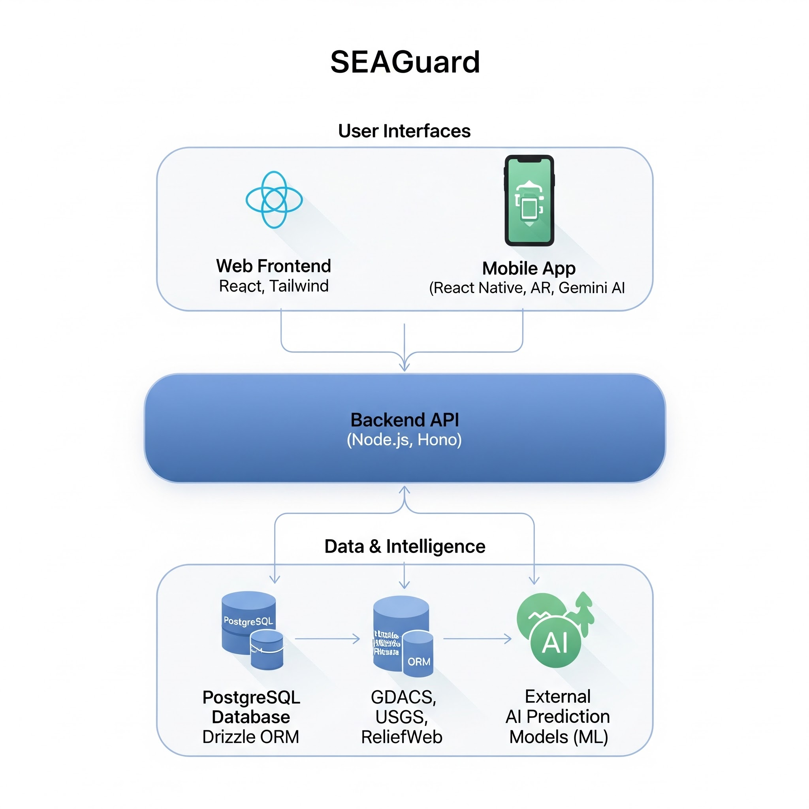
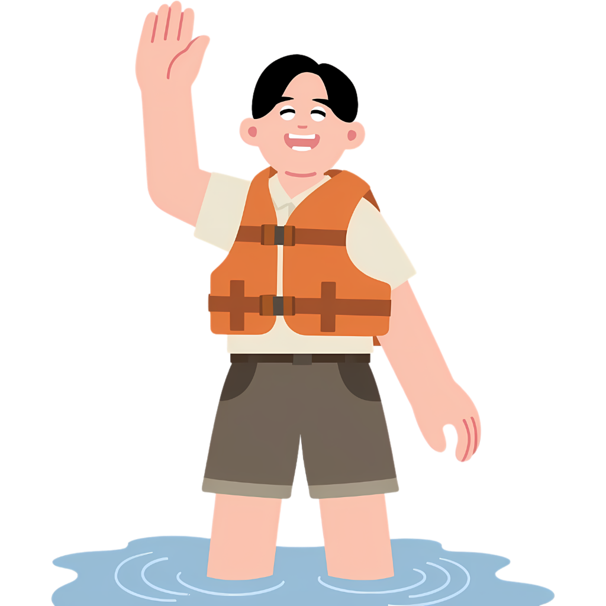

<!-- Logo -->

<h1>SEAGuard</h1>

<strong>Enhancing Disaster Preparedness and Community Resilience Across ASEAN Through AI and Real-Time Data</strong>

  
  
  

  Built for <a href="https://www.borneohackwknd.org/"><strong>Borneo Hackwknd</strong></a> — Southeast Asia's premier hackathon for solving regional challenges through technology.

---

## Problem Statement

Southeast Asia is one of the most disaster-prone regions in the world. The ASEAN region faces escalating threats from hydrometeorological hazards — particularly **floods, storms, and landslides** — that are intensifying due to climate change.

> **"Southeast Asia has experienced at least 1,575 hydrometeorological disasters since 1900, with floods and storms being the most frequent events. The occurrence of these disasters has significantly increased over the past 30 years."**
>
> — *ASEAN Trend Report DM 10 (2025)*

> **"More than 2,900 flood events were recorded between 2012 and 2022 across ASEAN member states."**
>
> — *ASEAN Trend Report DM 10 (2025)*

> **"In 2025 alone, floods and landslides across Indonesia, Thailand, and Malaysia resulted in over 1,100 fatalities, displaced hundreds of thousands of residents, and generated more than US$20 billion in economic losses."**
>
> — *ASEAN Regional Disaster Reports (2025)*

Despite the scale of these disasters, communities across ASEAN still struggle with:

- **Fragmented information** — risk warnings and evacuation procedures scattered across multiple institutions and platforms
- **Reactive response** — communities act only *after* disasters strike rather than preparing proactively
- **Limited evacuation guidance** — individuals don't know which routes are safe or which authorities to contact
- **Language barriers** — disaster platforms primarily use English, limiting accessibility for local communities
- **No localized risk forecasting** — existing tools focus on global-scale events, missing community-level hazards

---

## Solution

SEAGuard is an **AI-powered disaster management platform** that bridges these gaps by combining artificial intelligence, geospatial mapping, and real-time data to deliver **localized risk forecasts, early warning alerts, and evacuation guidance** to communities across ASEAN.

SEAGuard is available as **two complementary products**:

<!-- Platform Preview -->

  
   
  <em>SEAGuard Web Dashboard &amp; Mobile App</em>

 

### Web Platform

An interactive dashboard designed for regional situational awareness and institutional use.

**Real-Time Disaster Monitoring**
| Feature | Description |
|---|---|
| **Active Zones Map** | Interactive visualization of disaster zones categorized as Evacuation, Caution, and Danger |
| **Global & Local Alerts** | Real-time push notifications and alerts for ongoing and incoming hazards |
| **Risk Forecasts** | Data-driven predictions for upcoming environmental risks across the ASEAN region |

**Emergency Resources**
| Feature | Description |
|---|---|
| **Global Emergency Contacts** | Quick access to maritime and local emergency services across all ASEAN countries |
| **AI Chatbot Assistant** | 24/7 intelligent assistant for safety queries and emergency guidance |
| **Survival Guides** | Comprehensive, disaster-specific survival instructions available offline |

**Localization & Accessibility**
| Feature | Description |
|---|---|
| **Multi-language Support** | Fully localized in English, Bahasa Indonesia, Filipino, Thai, Vietnamese, Malay, Burmese, Khmer, and Lao |
| **Personalized Setup** | Personalized experience based on the user's location and preferred language |

### Mobile App

A location-aware companion app for on-the-ground emergency support.

**Smart Evacuation**
| Feature | Description |
|---|---|
| **Nearest Safe Zones** | Automatically detects and suggests the closest hospitals, shelters, and assembly points |
| **AR-Guided Navigation** | Immersive AR navigation paths (Viro AR) to guide users to safety in real-time |

**Disaster Simulator**
| Feature | Description |
|---|---|
| **AR Simulator** | Immersive AR experience to visualize disaster scenarios in a safe environment |
| **AI Voice Guide** | Interactive real-time assistant powered by Gemini AI providing step-by-step survival guidance |
| **Quiz Gamification** | Interactive quizzes to test and reinforce disaster preparedness knowledge |

**Community Reports**
| Feature | Description |
|---|---|
| **Crowdsourced Safety** | Real-time localized feeds of disasters reported by nearby users |
| **AI Hazard Scanner** | Snap a photo and let AI automatically detect hazard level and water depth for accurate reporting |

**Multilingual Support**
| Feature | Description |
|---|---|
| **All ASEAN Languages** | Fully localized in Indonesian, Thai, Vietnamese, Malay, Filipino, Khmer, Lao, and more — so no community is left behind |

---

## SDG Targets

SEAGuard directly contributes to three United Nations Sustainable Development Goals:

| SDG | Goal | How SEAGuard Contributes |
|:---:|---|---|
| **SDG 13** | Climate Action | AI-driven early warning and predictive analytics to strengthen adaptive capacity against climate-related hazards |
| **SDG 4** | Quality Education | Accessible disaster e-learning modules, survival guides, and curated news for community preparedness |
| **SDG 11** | Sustainable Cities & Communities | Geospatial risk mapping, community reporting, and disaster communication tools for safer urban and rural areas |

---

## System Architecture

SEAGuard is architected as a distributed system with clear separation between the backend services, web dashboard, and mobile application.

<!-- Architecture Diagram -->

  
   
  <em>Figure: SEAGuard System Architecture</em>

 

| Component | Technologies | Role |
|---|---|---|
| **Backend API** | Node.js, Hono, PostgreSQL, Drizzle ORM | High-performance REST API handling data ingestion, AI prediction, authentication, and real-time monitoring |
| **AI Models** | LGBM (Light Gradient Boosting Machine) | Binary flood and landslide risk classification using data from GDACS, USGS, and ReliefWeb |
| **Web Frontend** | React 18, TypeScript, Vite, Tailwind CSS, TanStack Query, shadcn/ui | Interactive dashboard for risk visualization, alerts, and disaster education |
| **Mobile App** | React Native, Viro AR, Google Gemini 2.5 Flash, React Native Maps, Google Places API | Location-based emergency support with AR navigation and AI-powered guidance |

---

## Prototype

Try SEAGuard now:

| Platform | Link |
|---|---|
| **Web Dashboard** | [seaguard.netlify.app](https://seaguard.netlify.app/) |
| **Android APK** | [Download from Google Drive](https://drive.google.com/drive/folders/1mtSj_nQmXwJLVnQTn9R34xf5T2Km5tDt?usp=sharing) |

---

## Contributors

Built with dedication by **Team LabtekV** for Borneo Hackwknd.

<table>
  <tr>
    <td align="center">
       
      <strong>Randy Verdian</strong> 
      <em>Team Leader</em>
    </td>
    <td align="center">
       
      <strong>Muhammad Althariq Fairuz</strong> 
      <em>Member</em>
    </td>
    <td align="center">
       
      <strong>Olivia Christy Lismanto</strong> 
      <em>Member</em>
    </td>
    <td align="center">
       
      <strong>Saad Abdul Hakim</strong> 
      <em>Member</em>
    </td>
    <td align="center">
       
      <strong>Shafiq Irvansyah</strong> 
      <em>Member</em>
    </td>
  </tr>
</table>

---

  Made with care for the communities of ASEAN &mdash; Team LabtekV &copy; 2025

